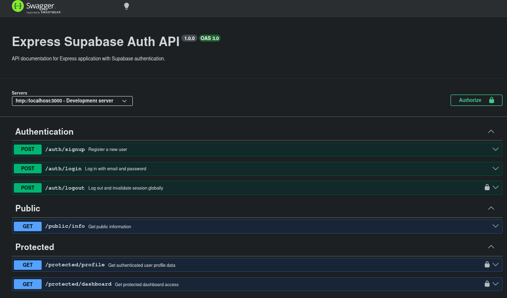

# AUTH-LOGIN_PROTECT
  This handles authentication and login protection using supabase service and expressJS library
## How to
* install the project using `npm install`
* run the project using `npm run dev`
* check all the required environment variables [here](.env.sample)

## API reference
```
+--------+------------------------+----------------+--------------------------------------------------------------+
| Method | Endpoint               | Auth Required  | Description                                                  |
+--------+------------------------+----------------+--------------------------------------------------------------+
| POST   | /auth/signup           | No             | Registers a new user using email and password.               |
| POST   | /auth/login            | No             | Authenticates user credentials and returns a JWT access token.|
| POST   | /auth/logout           | Yes (Bearer)   | Invalidates the user's session globally using the token.     |
| GET    | /public/info           | No             | Publicly accessible endpoint requiring no authentication.    |
| GET    | /protected/profile     | Yes (Bearer)   | Retrieves the authenticated user's profile data.             |
| GET    | /protected/dashboard   | Yes (Bearer)   | Grants access to the protected dashboard area.               |
+--------+------------------------+----------------+--------------------------------------------------------------+
```

## SWAGGER UI You can access the Swagger UI documentation at `/docs`

